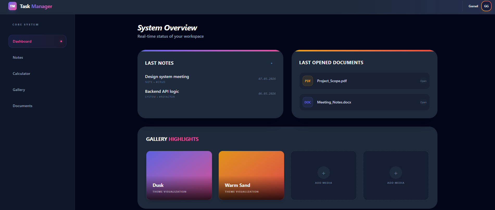

# Task Manager App

A full-stack Task Manager application built with **React 19**, **Tailwind CSS v4**, **Python Flask**, and **MongoDB**.



---

## Tech Stack

| Layer    | Technology           |
|----------|----------------------|
| Frontend | React + Vite + Tailwind CSS v4 |
| Backend  | Python + Flask      |
| Database | MongoDB              |

---

## Design System

The application features a modern dark-themed dashboard with custom color palettes:

- **Dusk Theme**: Indigo to Pink gradients for primary actions and system highlights.
- **Warm Sand**: Amber to Red gradients for documents and secondary accents.
- **Glassmorphism**: Border-based card designs and semi-transparent backgrounds.


## Project Structure

```
├── backend/
│   ├── app/
│   │   ├── __init__.py     # Flask app setup, CORS
│   │   ├── models.py       # MongoDB connection
│   │   └── routes.py       # API endpoints
│   ├── requirements.txt
│   └── run.py
│
└── react/
    └── frontend/
        └── src/
            └── App.jsx     # Main React component
```

---

## Features

- Add new tasks
- View all tasks
- Delete tasks
- Data saved in MongoDB (tasks stay after page refresh)

---

## Getting Started

### 1. Clone the repository

```bash
git clone <your-repo-url>
```

### 2. Start the Backend

```bash
cd backend
pip install -r requirements.txt
python run.py
```

Backend runs at: `http://localhost:5000`

### 3. Create `.env` file in `backend/`

```
MONGO_URI=mongodb://localhost:27017
```

### 4. Start the Frontend

```bash
cd react/frontend
npm install
npm run dev
```

Frontend runs at: `http://localhost:5173`

---

## API Endpoints

| Method | Endpoint       | Description        |
|--------|----------------|--------------------|
| GET    | /tasks         | Get all tasks      |
| POST   | /tasks         | Create a new task  |
| PUT    | /tasks/`<id>`  | Update a task      |
| DELETE | /tasks/`<id>`  | Delete a task      |

---

## Planned Features

These features are not ready yet, but they will be added in the future:

- **User Authentication** — Users will register and log in. Each user will see only their own tasks.
- **JWT Tokens** — After login, the app will use a secure token to keep the user logged in.
- **Task Priority** — Users will mark tasks as high, medium, or low priority.
- **Due Dates** — Users will set a deadline for each task.
- **Task Categories** — Users will group tasks (e.g. Work, Personal, School).
- **Search & Filter** — Users will search tasks and filter by status or category.
- **Dark Mode** — A dark theme option for the UI.
- **Mobile Friendly UI** — The app will work well on phones and tablets.

---

## Security Notes

- MongoDB connection string is stored in a `.env` file — not in the code.
- `.env` is listed in `.gitignore` — it is never uploaded to GitHub.
- CORS is configured to control which domains can access the API.
