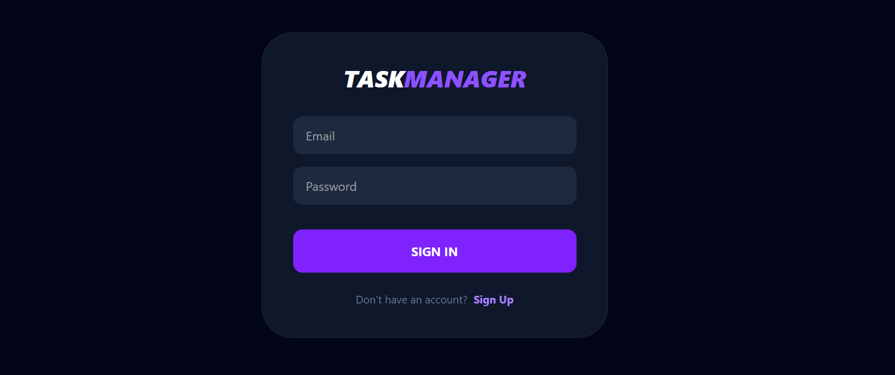

# Task Manager App

A full-stack Task Manager application built with **React 19**, **Tailwind CSS v4**, **Python Flask**, and **MongoDB**.




---

## Features

- **Auth System:** Secure Login and Register screens.
- **Quick Notes:** Create tasks with titles and specific dates.
- **Delete System:** Remove tasks with a single click.
- **Database Persistence:** All data is saved in MongoDB.

---

## Tech Stack

| Layer    | Technology           |
|----------|----------------------|
| Frontend | React + Vite + Tailwind CSS v4 |
| Backend  | Python + Flask      |
| Database | MongoDB              |

---

## Project Structure

```
├── backend/
│   ├── app/
│   │   ├── __init__.py
│   │   ├── models.py       # User and Task collections
│   │   └── routes.py       # Auth & Task API endpoints
│
└── react/
    └── frontend/
        └── src/
            ├── App.jsx     
            └── components/
                ├── Auth.jsx        # Login/Register Screen
                ├── LeftSideBar.jsx
                └── TopBar.jsx
```

---

## Getting Started

### 1. Clone the repository

```bash
git clone <your-repo-url>
```

### 2. Start the Backend

```bash
cd backend
pip install -r requirements.txt
python run.py
```

Backend runs at: `http://localhost:5000`

### 3. Create `.env` file in `backend/`

```
MONGO_URI=mongodb://localhost:27017
```

### 4. Start the Frontend

```bash
cd react/frontend
npm install
npm run dev
```

Frontend runs at: `http://localhost:5173`

---

## API Endpoints

| Method | Endpoint       | Description                 |
|--------|----------------|-----------------------------|
| POST   | /auth/register | Register a new user         |
| POST   | /auth/login    | Login and get session       |
| GET    | /tasks         | Get all tasks               |
| POST   | /tasks         | Create a new task with date |
| DELETE | /tasks/<id>    | Delete a task               |

---

## Planned Features

These features are not ready yet, but they will be added in the future:

- **User Authentication** — Users will register and log in. Each user will see only their own tasks.
- **JWT Tokens** — After login, the app will use a secure token to keep the user logged in.
- **Task Priority** — Users will mark tasks as high, medium, or low priority.
- **Due Dates** — Users will set a deadline for each task.
- **Task Categories** — Users will group tasks (e.g. Work, Personal, School).
- **Search & Filter** — Users will search tasks and filter by status or category.
- **Dark Mode** — A dark theme option for the UI.
- **Mobile Friendly UI** — The app will work well on phones and tablets.

---

## Security Notes

- MongoDB connection string is stored in a `.env` file — not in the code.
- `.env` is listed in `.gitignore` — it is never uploaded to GitHub.
- CORS is configured to control which domains can access the API.
